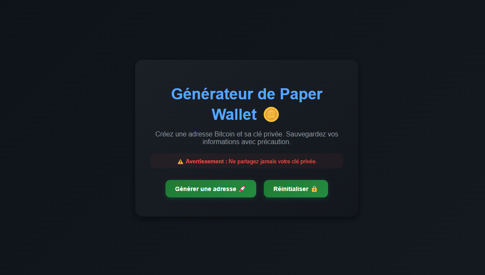
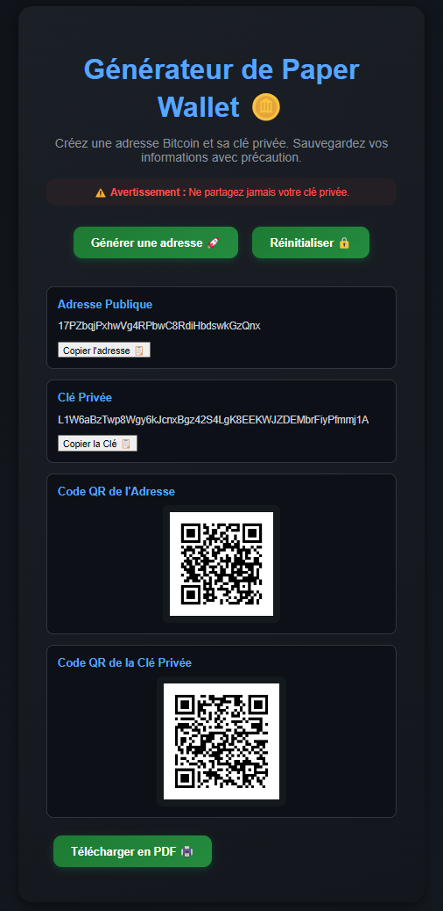

# **Générateur de Paper Wallet Bitcoin**

## 🚀 **Description**
Ce projet est une application web interactive qui permet aux utilisateurs de générer une adresse Bitcoin (clé publique) et sa clé privée associée. L'application fournit également :
- Un QR Code pour chaque clé.
- Une option pour exporter les informations en PDF.
- Une fonctionnalité pour copier facilement les adresses.

---

## 🛠️ **Fonctionnalités**
1. **Génération des clés Bitcoin :**
   - Création d'une clé publique et d'une clé privée.
   - Génération sécurisée basée sur la bibliothèque `bitcoinjs-lib`.

2. **Export PDF :**
   - Les informations générées peuvent être téléchargées sous forme de PDF.

3. **QR Codes :**
   - Génération de QR Codes pour les adresses publiques et privées, permettant une utilisation facile via des scanners QR.

4. **Copie facile :**
   - Boutons pour copier les clés directement dans le presse-papiers.

5. **Design Moderne :**
   - Interface élégante et intuitive.

---

## 📦 **Installation**

### Prérequis
- **Node.js** (version 16 ou supérieure)
- **npm** (version 7 ou supérieure)

### Étapes d'installation
1. **Cloner le dépôt :**
   ```bash
   git clone https://github.com/Urushin/paper-wallet-generator.git
   cd paper-wallet-generator
   ```

2. **Installer les dépendances :**
   ```bash
   npm install
   ```

3. **Démarrer l'application :**
   ```bash
   npm start
   ```

4. **Accéder à l'application :**
   - Rendez-vous sur [http://localhost:3000](http://localhost:3000) dans votre navigateur.

---

## 🛡️ **Avertissement de Sécurité**
- **Ne partagez jamais votre clé privée.**
- **Conservez les clés générées dans un endroit sécurisé.**
- Les informations sensibles ne sont **pas stockées** dans le navigateur ni sur un serveur distant. Toutes les opérations sont effectuées localement dans votre navigateur.

---

## 🖼️ **Aperçu de l'Interface**
| Fonctionnalité | Aperçu |
|----------------|--------|
| **Menu** |  |
| **Génération de clés + QRCodes**          |  |